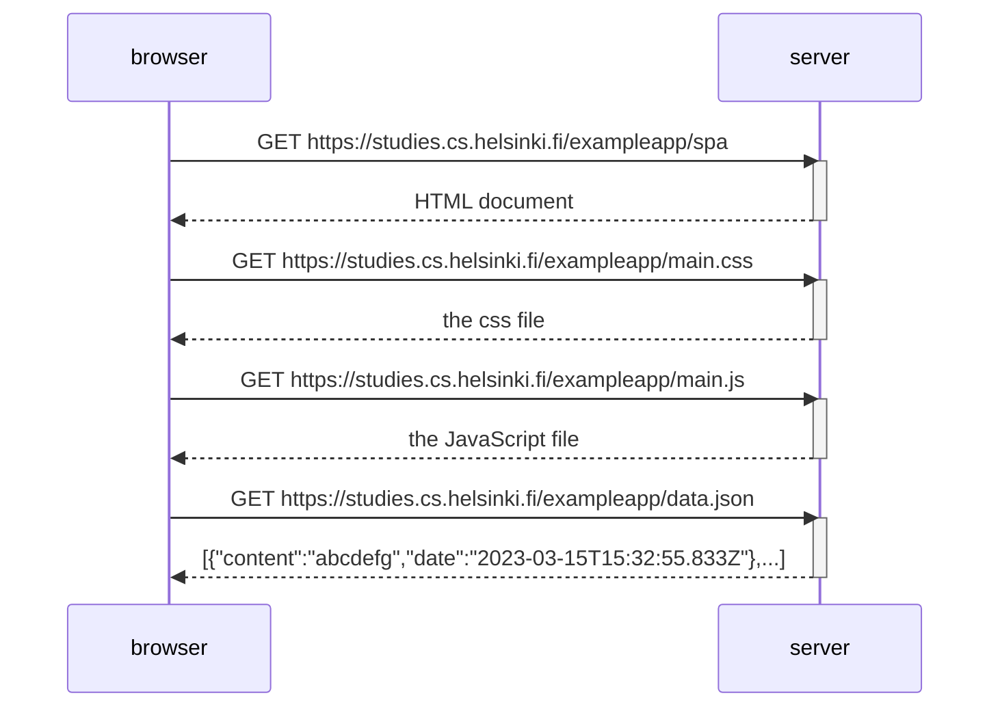

```mermaid
  sequenceDiagram
      participant browser
      participant server

      browser->>server: GET https://studies.cs.helsinki.fi/exampleapp/spa
      activate server
      server-->>browser: HTML document
      deactivate server

      browser->>server: GET https://studies.cs.helsinki.fi/exampleapp/main.css
      activate server
      server-->>browser: the css file
      deactivate server

      browser->>server: GET https://studies.cs.helsinki.fi/exampleapp/main.js
      activate server
      server-->>browser: the JavaScript file
      deactivate server

      browser->>server: GET https://studies.cs.helsinki.fi/exampleapp/data.json
      activate server
      server-->>browser: [{"content":"abcdefg","date":"2023-03-15T15:32:55.833Z"},...]
      deactivate server
```

