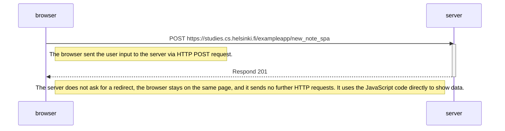

```mermaid
  sequenceDiagram
      participant browser
      participant server

      browser->>server: POST https://studies.cs.helsinki.fi/exampleapp/new_note_spa
      activate server
      Note right of browser: The browser sent the user input to the server via HTTP POST request.

      server-->>browser: Respond 201 
      deactivate server
      Note right of browser: The server does not ask for a redirect, the browser stays on the same page, and it sends no further HTTP requests. It uses the JavaScript code directly to show data.
```

